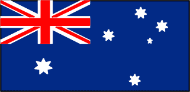

<HTML>
<HEAD>
<TITLE>The Favourite Thing page </TITLE>

</HEAD>

<BODY>
<h1 class="big" style="background-color: black;">The Favourite Thing page</h1>

My favourite thing is bicycles. A bicycle is  a small, human powered land vehicle with a seat,
  two wheels, two pedals, and a metal chain connected to cogs on the pedals and rear wheel.
  A frame gives the bike strength, and the other parts are attached to the frame.
<EM>  The reason I like bicycle it's becasue bicycle allow me to travel place to place and
   is a pollution-free mode of transport.</EM>

<A HREF="https://en.wikipedia.org/wiki/Bicycle">Further information about bicycle  </a>
<A HREF="Home page.html" target="main">The Home page  </a>
<A HREF="The Favourite Place page.html" target="main">The Favourite Place page  </a>
<BODY>
<HTML>
